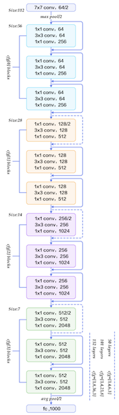
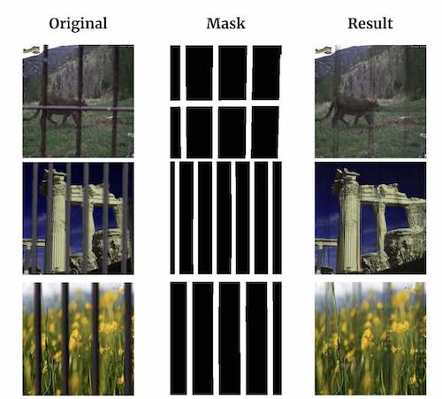

# De-fence-estration: Self-Supervised Image Segmentation and Inpainting for Fence Removal
By Ethan Ruoff, Natalia Dorogi, and Drew Sirenko

Video presentation of paper: https://youtu.be/bBIkBClb120

**Abstract &mdash; In this report, we provide the details about our final project De-fence-estration. This project uses self-supervision to train image segmentation and inpainting to find and remove fences in RGB images. This process can be useful in many photography-related situations where fences block the subject of interest in situations including zoos, ruins, sporting events, and landscapes. This project aims to address the demand for a simple way to remove fences for tourists and professional photographers alike by detecting and filling fence regions.**

## 1. Introduction
Computer vision is one of the fastest-growing fields within
computer science, with innovations and developments
published every year. Through this course, we were able to
read about recent accomplishments within the space. One of
the many uses of computer vision is image segmentation and
image inpainting. Image segmentation involves a process of
dividing an input image into different regions by
characteristics of pixels, in order to delineate boundaries to
simplify an image and more efficiently analyze it. Image
inpainting has been around for many years, but has gained
more popularity due to improvement of processing techniques.
Inpainting generally is a process where missing pixels/parts of
an image are filled to match a complete one.

De-fence-estration, hopes to accomplish this feat within
photo-editing and give the computer the knowledge of where a
fence is to remove it, and greatly simplify the editing task for
users for whom photoshop may not be a viable solution
whether due to resources, time, or skill level.

The need for De-Fence-estration has greatly increased in
recent years. The surge of this problem has two primary
factors - an increase of low-cost smartphones allowing for
more widespread access to photography and the presence of
fences in the way of images of interest due to security
concerns of tourists, students, and audiences. The computer
can extrapolate the area of an image that the fence covers. The
segmentation can then be used alongside an additional object
inpainting model to re-populate the image for seamless
removal of occlusions in such images.

## 2. Overview
De-fence-estration is a network that can identify the fence
over an image as a mask via image segmentation and utilize
inpainting to remove the mask from the image, allowing for
users to remove fences from their photographs. The flow of
training for this project is: a scene image and fence are passed
into the dataloader, which outputs the combined image with
various augmentations to allow for more diverse training data.
The combined image and mask are then used as inputs into the
image segmentation model. Concurrently, the combined
image, mask, and image are passed into the inpainting model.
The image segmentation outputs the mask as a label while the
inpainting model outputs an attempt at recreating the original
image.

The first model is a CNN that takes in the input image and
uses pixel-level segmentation to output a mask of the hand
location. This uses a domain transferred ResNet50
architecture that’s fully connected layer is replaced with a
linear layer that matches the image’s dimensions to become a
one-to-one image segmentation.

After segmenting the fence in our image and generating an
image mask for it, we feed in our original image as well as the
mask as inputs to our inpainting model. The inpainting model
is our transfer-learned implementation to the GAN inpainting
model DeepFill v2. Given an image and a mask of what
we want to be removed from the image, this model will output
an image that has replaced large segments of the fence with
patterns that fit the context of the rest of the image.

### 2.1. Folder Structure
The entire pipeline discussed in the previous section is
controlled by the *main.py* script in the root directory of the
repository.

The training data we used can be found in the *Images* and
*Fences* folders. Images is sorted by category based on the
categories in MIT Places Database [1] while Fences contains
30 pictures of fences with transparent backgrounds.

The versions we decided to use for model training are
located in the *seg_model.ipynb* and *inpainting.ipynb* jupyter
notebook.

Two folders used extensively but included in the gitignore
are *Images* and *saved_models*. The Images folder contains
84,483 images used for training. The *saved_models* folder
contains all of the trained models including prototype models.
The contents of these folders can be downloaded here.

Lastly, the *Samples* folder contains images used as figures
in this report as well as additional images and gifs used for
other content such as the video and README.

## 3. Previous Work
Identification of objects in images has a long history of
research attributed to it. From a survey of prior work, we
learned that pipelines used to be based on ResNet and then
GANs which have been getting more effective year by year as
technology evolves. We combined two genres of prior work
into our project.

One includes a semi-supervised approach to computer
vision problems. In Colorful Image Colorization [4], the
researchers aimed to work on colorizing photos without any
labels. Their method for training the model was to take a
collection of color images, make them greyscale so that they
could feed back the original, correct images. We took a similar
approach with fences and our dataset - we took our original
image and added the fence so that we could have both the
input and correct output without manually labelling data.

The second genre of work was image inpainting papers
where given an image and a mask, an image is refilled without
the mask portion, resulting in a complete image [3]. Deep
learning models are able to recreate the parts of the image
previously covered by the mask without needing all the
information that was concealed. We leveraged image
segmentation to create the fence as the mask and let our
inpainting model recreate the remaining parts of the image.

## 4. Data Preprocessing
To determine our training data, we created a dataset using
images of fences, selected scenes, and the dataloader. Photos
of various fences around Columbia University were taken
using a green screen to provide masks for our photos. To
determine the scenes we utilized, we analyzed and manually
chose from the MIT Places Dataset. Among the MIT Places
Dataset were 205 scene categories with 2.5 million images.
The goal for our dataset was for it to be representative of a
variety of scenes, colors, and subjects that would be
obstructed by fences. Thus, we narrowed the database to 6
relevant categories: f_field_wild, d_desert_sand, c_canyon,
f_formal_garden, b_baseball_field, and r_ruin. After getting
access to the MIT Places Dataset, we downloaded our
pre-selected categories.

The MIT Places Dataset categories are then preprocessed
via *dataloader.py*. This takes the original image, through
which we performed color jitter, and image flipping, among
other data-augmentation methods. Since we only have 30
fences currently, we greatly increase the diversity of this
dataset by using high-resolution versions of the images and
randomly cropping/resizing a small cross-section of them.
When fences from our manually made dataset are used with
an image, the fence is blurred to imitate an out-of-focus fence
and flipped as well. After both parts of the image are
augmented, the fence is overlaid on top of the input image.
The image is lastly normalized with the recommended
Image-Net values [2] to be optimized for use with the
pretrained ResNet50 parameters. You can see three examples
of augmented data in Fig. 5.

Using the augmented fence, we also create a perfect mask
by thresholding the alpha values and converting opaque pixels
to white and transparent pixels to black.

There was also additional preprocessing that was
model-specific:

### 4.1. Image Inpainting Preprocessing
Image inpainting data-preprocessing also dilates the mask
with a 3x3 kernel. This allows the inpainting model to have
fewer fence pixels after the image segmentation step so that
the inpainting doesn’t try to paint the fences back into the
photo.

## 5. Models
### 5.1. Model1: Image Segmentation
The first model of De-Fence-estration is a domain
transferred ResNet50 model using the pre-trained weights
from ImageNet [2], the BCEwithlogitloss function, and the
Adam Optimizer. The methodology of Model1 is that an
image and corresponding mask are passed in as input. The
model then outputs a binary classification for each pixel,
categorizing it as either fence or not fence.

Table 1   Model1 Results

#### 5.1.1. Testing Multiple Architectures
When testing and fine-tuning our model, we performed
multiple tests to see whether we should use ResNet18 or
ResNet50. We thought ResNet50 would be the better choice
because it is more lightweight and less resource-intensive to
train multiple iterations for finetuning. Unfortunately, its
performance was not up to par, only achieving a validation
precision of 15.42% as seen in Table 1. We suspect that this is
because ResNet18 was struggling to converge due to its fewer
layers. In the end, the 70.47% advantage the ResNet50 held
was worth the hit to performance and resource intensity.

#### 5.1.2. Model1 Findings

Despite our higher accuracy, we still found that the masks
had gaps and only worked on black fences. To fix the gaps, we
added dilation with a 3x3 kernel as post-processing to our
masks. This fills any black pixels that might have slipped
between the cracks of the model. As for the failure to identify
non-black fences, we believe this is due to a lack of diversity
in our training data. Further research into diversifying our
dataset and further augmentation will need to be taken in order
to confirm this hypothesis.

### 5.2. Model2: Inpainting
The second model of De-Fence-estration is created by
performing transfer learning on the state of the art generative
deep image inpainting DeepFill v2.

#### 5.2.1. Model2 Prototypes
This project involved implementing multiple inpainting
architectures with minimal results. For example, we tried
training a GAN but encountered resource limitations due to
GAN’s long training times. Thus, we did transfer learning
instead to make the most of our resources. We also tested a
U-Net with partial convolutions [3] but ran into difficulties
with poor documentation and outdated code. We eventually
went with DeepFill v2’s Encoder/Decoder models [5].

#### 5.2.2. Model2 Architecture
The goal of the model is to ‘paint’ in missing pixels of an
image in a way that follows the original context of the image
(i.e. A beach be in-painted with sand instead of a zebra). The
original DeepFillv1 brought in contextual attention such that
the model would look at various features in the image not
nearby the missing hole in order to better decide what should
be painted in the region. DeepFill v2 builds on this approach
by adding gated convolutions, a learnable version of partial
convolutions, such that pixels can be decided whether they
belong in a certain region or not even better.

#### 5.2.3. Model2 Findings
We performed transfer learning on the above model by
feeding in images and masks with fence shapes, as well as
getting the model used to our test image domains of flowers,
deserts, and animals. This worked far better than training our
own GAN because it had some basic inpainting skills out of
the box and we wouldn’t have to spend many more weeks
training it. Finally this fine-tuning approach meant that our
model performed better with imperfect fence masks due to
low contrast images or other peculiarities of our data.

## 6. Data Postprocessing
During data postprocessing, we unnormalized the data to
rebalance the colors for the user. Additionally, for
implementation we dilate the image segmentations to fill any
missing pixels in the mask. This prevents the inpainting from
trying to repaint pieces of the fence when inferencing the
missing context.

## 7. Results and Findings
We tested our pipeline on the variety of images from our
dataloader. We found that Model1 (5.1) generalizes really well
with random photos of black fences, seen in Fig. 8. We found
that Model2 (5.2) worked well regardless of scene subject or
distance or coloring. The results of the image segmentation
model included accuracy of 92.3%, precision of 85.9%, and
recall of 86.4% (Table 1).

Although we’re reporting 92.3% accuracy on fences, we
found that the model did not generalize well for non-black
fences, e.g., a dark green fence (typically found at
sporting-related competitions and parks). This is an indication
that our model heavily uses color in order to identify fences
and has not been trained with enough variety of fence colors.
Indeed, in our creation of the fences used for training they
were black which can be attributed to as primarily an issue of
limited fence colors found around Columbia University.

## 8. Conclusion and Next Steps
We created a relatively effective two-layer approach for
removing fences from images. This network uses a pixel-level
segmentation to find the fence and then an encoder-decoder
based GAN to replace the masked region with pixels based on
the surrounding context. We achieved this with a fully
self-supervised network achieving only slightly worse results
than fully supervised versions.

Further research is required to make a more effective
architecture that can better recognize and inpaint fences.
Potential improvements could be made by adding more
pictures of fences into the dataset. More specifically, by
adding more non-black fences, the data will become more
diverse and therefore better at segmenting fences. In addition,
more training and finetuning are required on our
transfer-learned version of DeepFill v2. Due to time and
resource restraints, the model was not trained to our
satisfaction. Given more time and resources, we believe that
we could better tune our model to color-match surrounding
pixels.

## References
[1] B. Zhou, A. Lapedriza, J. Xiao, A. Torralba, and A. Oliva.
“Learning Deep Features for Scene Recognition using Places Database.”
Advances in Neural Information Processing Systems 27 (NIPS), 2014. PDF
Supplementary Materials

[2] J. Deng, W. Dong, R. Socher, L. -J. Li, Kai Li and Li Fei-Fei,
"ImageNet: A large-scale hierarchical image database," 2009 IEEE
Conference on Computer Vision and Pattern Recognition, 2009, pp. 248-255,
doi: 10.1109/CVPR.2009.5206848.

[3] Liu G, Reda FA, Shih KJ, Wang TC, Tao A, Catanzaro B. “Image
inpainting for irregular holes using partial convolutions.” In: Proceedings of
the European Conference on Computer Vision (ECCV), 2018.

[4] Zhang, R., Isola, P., and Efros, A. A., “Colorful Image
Colorization”, arXiv e-prints, 2016.

[5] Yu, J., Lin, Z., Yang, J., Shen, X., Lu, X., and Huang, T.,
“Free-Form Image Inpainting with Gated Convolution”, arXiv e-prints, 2018.